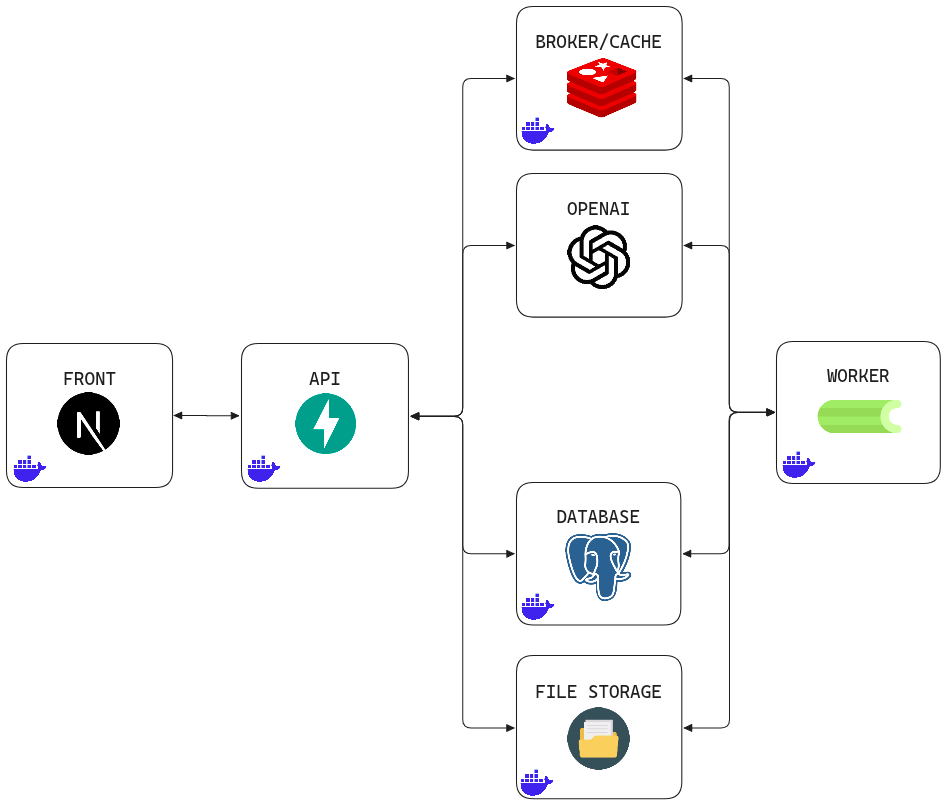

# Smart Library

Smart Library is an AI-powered library application for uploading books, processing their content into semantic chunks, and chatting with the processed knowledge base in Portuguese.

<p align="center">
  
</p>
<p align="center">
  <em>Architecture Diagram</em>
</p>

The project includes:

- A FastAPI backend for books, chats, uploads, processing status, and SSE streams.
- A Celery worker for document processing and embedding generation.
- PostgreSQL with pgvector for semantic search.
- Redis for broker/cache responsibilities and processing progress snapshots.
- A Dockerized Next.js frontend for book management and chat interaction.

## Installation

### Requirements

- Docker
- Docker Compose
- An OpenAI API key

### Configure Environment Variables

Create a `.env` file from the example file:

```bash
cp .env.example .env
```

Fill in the required values

### Start The Application

Run all services with Docker Compose:

```bash
docker compose up --build
```

The services will be available at:

- Frontend: `http://localhost:3000`
- API: `http://localhost:8000`
- API documentation: `http://localhost:8000/docs`

The API container runs database migrations automatically on startup.

## How To Use

### 1. Open The Books Page

Go to:

```txt
http://localhost:3000/books
```

Register a book by filling in the form and uploading a PDF, JPG, JPEG, or PNG file.

You can use the book **Python para Todos**, by Charles R. Severance:

```txt
https://do1.dr-chuck.com/pythonlearn/PT_br/pythonlearn.pdf
```

Suggested metadata:

- Title: `Python para Todos`
- Author: `Charles R. Severance`
- Type: `Técnico`
- Publication date and summary: Use whatever data you want, as it's not relevant for testing

After submitting the book, the file is sent to the backend and processed by the worker. The processing progress is displayed in real time on the book card through Server-Sent Events.

When processing fails, the card shows the number of processing attempts and a retry button.

### 2. Open The Chat Page

After the book processing is complete, go to:

```txt
http://localhost:3000/chat
```

Ask a question in Portuguese about the uploaded book, for example:

```txt
Como criar uma lista em Python?
```

The assistant will stream the answer in real time and use the processed book chunks as context when relevant.

The chat page also supports:

- Creating new conversations automatically.
- Opening previous conversations.
- Editing chat titles.
- Deleting conversations with a confirmation modal.
- Markdown rendering in assistant responses.

## Future Implementations

- Increase API test coverage and create tests for the broker layer.
- Improve chunk generation to extract richer semantic information from documents.
- Improve prompt engineering for the chat assistant.
- Create an AI provider adapter and an Ollama container, allowing AI processing to run either locally or through OpenAI.
